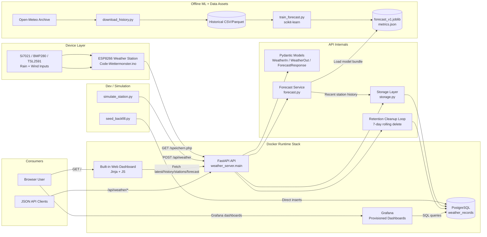

# Architecture

This repo is a local weather platform built around an ESP8266 station, a Python API, PostgreSQL, a browser dashboard, and Grafana. The physical station reads sensors, sends measurements over Wi-Fi to the API using the legacy GET endpoint, the API validates and stores them in Postgres, then exposes the data back out through JSON endpoints, a Jinja-rendered web UI, and Grafana dashboards. On top of that, the server can generate a simple short-range precipitation forecast from recent station history using a pre-trained scikit-learn model.

The live server architecture is defined by `server/README.md`, `server/docker-compose.yml`, and `server/src/weather_server/main.py`. 

## Diagram

## Main Components

- `Code-Wettermonster.ino` is the ESP8266 firmware. It connects to Wi-Fi, reads a Si7021 temperature/humidity sensor, BMP280 pressure sensor, TSL2591 light sensor, plus rain and wind inputs, derives wind direction from analog voltage, and uploads readings to `/speichern.php` on the local server using query parameters.
- `server/src/weather_server/main.py` is the FastAPI entrypoint. It creates the app, enables CORS, initializes the database on startup, runs a periodic cleanup task, serves the root dashboard page, and exposes the ingest, history, station-list, health, and forecast endpoints.
- `server/src/weather_server/models.py` defines the request and response schemas. Incoming weather payloads are range-validated with Pydantic, especially wind direction, so bad client data is rejected before storage.
- `server/src/weather_server/storage.py` is the persistence layer. It uses psycopg against a single `weather_records` table with indexes on `received_at` and `station_id` plus `received_at`. It handles inserts, latest-row lookup, time-window history queries, station aggregation, and retention cleanup.
- `server/src/weather_server/forecast.py` loads a joblib model bundle lazily and turns recent readings into features that match training-time features. It predicts precipitation class for horizons of 1, 3, 6, 12, and 24 hours with labels `none`, `rain`, and `snow`.
- `server/src/weather_server/templates/index.html` is a server-rendered dashboard with client-side fetches. The browser loads stations, latest reading, history, and forecast from the API, and it derives the visual scene from the selected station's latest reading only: light controls day/dusk/night, rain plus temperature decides rain versus snow, humidity plus low wind can produce fog, and that drives the background image and overlays.
- `server/grafana/provisioning/datasources/datasource.yml` and `server/grafana/provisioning/dashboards/dashboards.yml` auto-wire Grafana to Postgres and auto-load dashboards at container start.
- `server/grafana/dashboards/weatherstation.json`, `server/grafana/dashboards/unnede.json`, and `server/grafana/dashboards/ausblick.json` are the dashboard definitions. They visualize current conditions and time series directly from SQL queries against `weather_records`, including weather-background panels driven from the latest row.
- `server/scripts/download_history.py` downloads long-range hourly ERA5/Open-Meteo archive data for a chosen latitude and longitude.
- `server/scripts/train_forecast.py` builds training features, creates labels for multiple forecast horizons, trains one `HistGradientBoostingClassifier` per horizon, and writes the model bundle plus metrics.
- `server/scripts/seed_backfill.py` inserts synthetic historical rows directly into Postgres so the forecast endpoint has enough history during development.
- `server/scripts/simulate_station.py` is a virtual station client that posts realistic synthetic readings to the JSON ingest endpoint for testing dashboards without hardware.
- `server/Dockerfile` packages the API in Python 3.12 with `uv`. `server/pyproject.toml` declares the runtime dependencies: FastAPI, Uvicorn, Jinja2, psycopg, NumPy, pandas, scikit-learn, and joblib.
- `server/data/history/openmeteo_47.5217_12.4342_2016-01-01_2025-12-31.csv` is the offline training dataset already present in the repo.
- `server/data/models/forecast_v1.joblib` and `server/data/models/forecast_v1.metrics.json` are the trained model artifact and its evaluation output.
- `server/src/weather_server/static/wilder-kaiser` contains the background imagery and credits used by the built-in web dashboard.
- `server/src/weather_server.egg-info` is generated packaging metadata, not primary application logic.

## How It Works End To End

At runtime, Docker Compose starts three services from `server/docker-compose.yml`: Postgres, the API container, and Grafana. The API starts, creates the `weather_records` table if needed, cleans old rows, and then keeps deleting data older than the configured retention window once per hour. The ESP8266 or simulator sends weather samples, the API authenticates them with a shared key, validates their shape and ranges, and writes them into Postgres.

From there, three consumers read the same stored data. The JSON API serves latest, history, and station metadata to any client. The built-in dashboard at `/` renders a lightweight HTML page and then fetches data asynchronously to update the latest cards, raw history table, station selector, and forecast panel. Grafana bypasses the API for visualization and queries Postgres directly using the provisioned datasource and canned SQL panels. The forecast endpoint sits on top of storage history: it fetches recent rows, resamples them hourly, computes trend and cyclic features, and runs the model bundle to return class probabilities for each forecast horizon. If there is not enough recent station history, forecast returns `503` by design.

The repo is therefore a complete vertical slice: embedded device firmware, backend API, database schema and retention, browser UI, Grafana observability, offline ML training, simulation tools, and bundled data/model assets.
